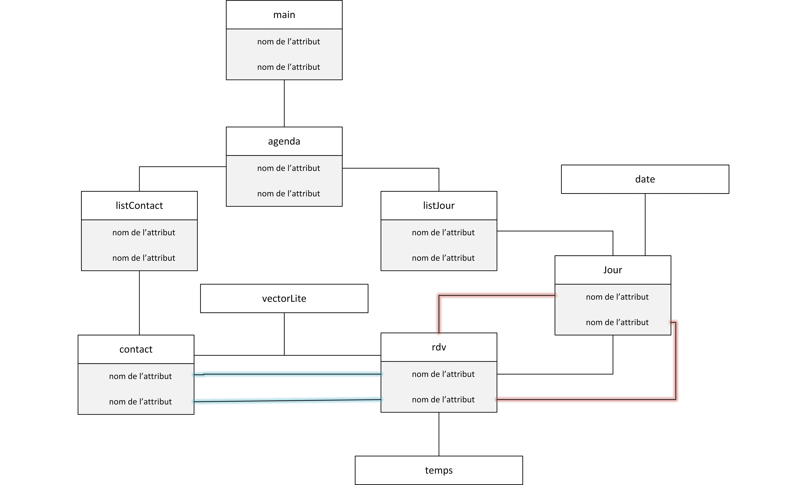

# Projet de Structure de Données

**Mémo GitLab / Git**

** **

Créer un compte sur https://github.com

Installer git : https://git-scm.com/downloads

Dans votre ligne de commande, tapez :

`git config --global user.name &quot;[Prenom] [Nom]&quot;`

`git config --global user.email &quot;[username]@[…]&quot;`

Afin de vous créer un clone de travail local, tapez :

`git clone [https://github.com/vdidon/Projet-Structure-de-Donnees.git](https://github.com/vdidon/Projet-Structure-de-Donnees.git)`

Cela a pour effet de créer un dossier [projectname] dans lequel vous pourrez travailler.

_Commandes git courantes_

`git status`

Permet de connaître l&#39;état actuel de votre dépôt local : liste des fichiers sous contrôle contenant des modifications, liste des fichiers présents et non contrôlés, etc.

`git remote -v`

Permet de voir la liste des dépôts distants connus (&quot;origin&quot; est le nom du dépôt distant depuis lequel le dépôt local a été cloné)

`git diff [file]`

Permet de voir les modifications apportées à un fichier et non encore commitées

`git checkout -- [file]`

Permet d&#39;annuler les modifications apportées à un fichier et de le remettre dans l&#39;état où il était précédemment

`git add [file]`

Permet aussi bien :

- --d&#39;ajouter un fichier non contrôlé au dépôt lors du prochain commit
- --d&#39;ajouter les modifications d&#39;un fichier sous contrôle au prochain commit

`git reset HEAD [file]`

Permet d&#39;enlever un fichier de la liste des fichiers à ajouter au prochain commit

`git commit --all -m "..."`

Permet d&#39;ajouter un commit au dépôt (sous réserve d&#39;avoir fait au moins un add avant). Cette commande permet de saisir le message du commit et voir au passage la liste des fichiers concernés

`git pull`

Récupère les commits du dépôt d&#39;origine dont le dépôt local ne dispose pas encore

`git push`

Envoie vers le dépôt d&#39;origine les commits dont il ne dispose pas encore (vous pouvez constater sur l&#39;interface web GitLab que vos nouveaux commits ont bien été ajoutés)

_Mise en commun du travail_

Une fois que vous avez créé des commits dans votre dépôt de travail (`git commit`) et envoyé ces commits dans votre dépôt distant (`git push`), vous allez pouvoir les proposer pour intégration au sein du dépôt commun du groupe.